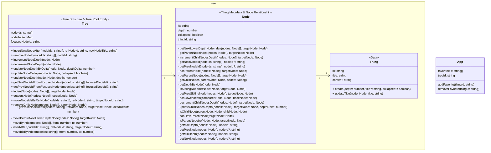

# @voyl/desktop

An Electron application with React and TypeScript

## Recommended IDE Setup

- [VSCode](https://code.visualstudio.com/) + [ESLint](https://marketplace.visualstudio.com/items?itemName=dbaeumer.vscode-eslint) + [Prettier](https://marketplace.visualstudio.com/items?itemName=esbenp.prettier-vscode)

## Project Setup

### Install

```bash
$ pnpm install
```

### Development

```bash
$ pnpm dev
```

### Build

```bash
# For windows
$ pnpm build:win

# For macOS
$ pnpm build:mac

# For Linux
$ pnpm build:linux
```

## Project Structure and Rules

### Layers

- pages/ # UI Layer: Routing, Page Composition, Domain Communication
- features/ # Domain Layer: Business Logic and Domain-specific UI
- common/ # Common Layer: Global Utilities

### Core Components

- components/ # UI Components
- hooks/ # Logic Separation
- utils/ # Utility Functions
- types/ # Type Definitions
- constants/ # Constants
- model/ # Domain Model (features only)
  - index.ts # Store Definition
  - entity.ts # Business Logic

### Dependency Rules

- components:
  - Can import same-level components
  - Can import hooks, utils, types, constants
- hooks:
  - Can import same-level hooks
  - Can import utils, types, constants
- utils:
  - Can import same-level utils
  - Can import types, constants
- constants:
  - Can import same-level constants
  - Can import types
- types:
  - Can import same-level types
  - No external dependencies
- model/index.ts: Can import model/entity.ts

### Layer Access Rules

- pages/
  - Can only import direct files from feature domain folders
    - Allowed:
      - features/DomainA/components/index.ts
      - features/DomainA/hooks/useHook.ts
      - features/DomainA/types/index.ts
      - features/DomainA/utils/index.ts
      - features/DomainA/constants/index.ts
      - features/DomainA/model/index.ts
    - Not Allowed:
      - features/DomainA/components/SubComp/index.ts
      - features/DomainA/hooks/something/useHook.ts
  - Can only import direct files from common
    - Allowed:
      - common/components/index.ts
      - common/hooks/useHook.ts
      - common/types/index.ts
      - common/utils/index.ts
      - common/constants/index.ts
    - Not Allowed:
      - common/components/Button/index.ts
      - common/hooks/form/useForm.ts
- features/
  - Domains operate independently
  - Internal domain follows component dependency rules
  - Can only import direct files from common (same rules as pages)
- common/
  - Accessible from all layers (direct files only)
  - Internal structure follows component dependency rules

### Shared Folder Rules

- Each layer or domain can have a shared folder
- Only accessible within its own folder and substructure
- Example: features/DomainA/shared is only accessible within DomainA
- Shared folders follow the same structure as core components

## Model


