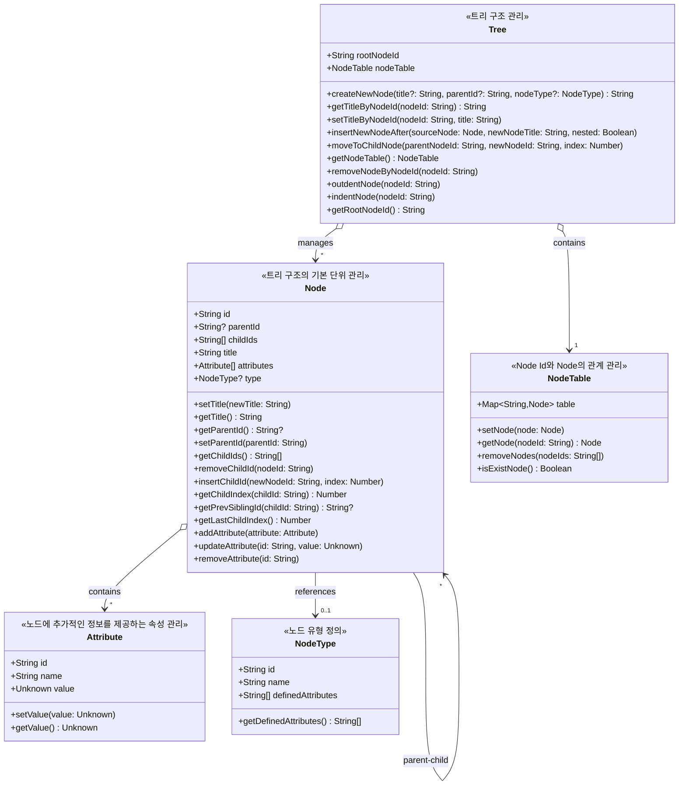

```mermaid
classDiagram
  class Node {
    <<트리 구조의 기본 단위 관리>>
    +String id
    +String? parentId
    +String[] childIds
    +String title
    +Attribute[] attributes
    +NodeType? type

    +setTitle(newTitle: String)
    +getTitle() String
    +getParentId() String?
    +setParentId(parentId: String)
    +getChildIds() String[]
    +removeChildId(nodeId: String)
    +insertChildId(newNodeId: String, index: Number)
    +getChildIndex(childId: String) Number
    +getPrevSiblingId(childId: String) String?
    +getLastChildIndex() Number
    +addAttribute(attribute: Attribute)
    +updateAttribute(id: String, value: Unknown)
    +removeAttribute(id: String)
  }

  class Tree {
    <<트리 구조 관리>>
    +String rootNodeId
    +NodeTable nodeTable

    +createNewNode(title?: String, parentId?: String, nodeType?: NodeType) String
    +getTitleByNodeId(nodeId: String) String
    +setTitleByNodeId(nodeId: String, title: String)
    +insertNewNodeAfter(sourceNode: Node, newNodeTitle: String, nested: Boolean)
    +moveToChildNode(parentNodeId: String, newNodeId: String, index: Number)
    +getNodeTable() NodeTable
    +removeNodeByNodeId(nodeId: String)
    +outdentNode(nodeId: String)
    +indentNode(nodeId: String)
    +getRootNodeId() String
  }

  class NodeTable {
    <<Node Id와 Node의 관계 관리>>

    +Map~String,Node~ table

    +setNode(node: Node)
    +getNode(nodeId: String) Node
    +removeNodes(nodeIds: String[])
    +isExistNode() Boolean
  }

  class Attribute {
    <<노드에 추가적인 정보를 제공하는 속성 관리>>
    +String id
    +String name
    +Unknown value
    +setValue(value: Unknown)
    +getValue() Unknown
  }

  class NodeType {
    <<노드 유형 정의>>
    +String id
    +String name
    +String[] definedAttributes
    +getDefinedAttributes() String[]
  }

  Tree o--> "1" NodeTable : contains
  Tree o--> "*" Node : manages
  Node o--> "*" Attribute : contains
  Node --> "0..1" NodeType : references
  Node --> "*" Node : parent-child
```
