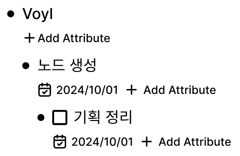
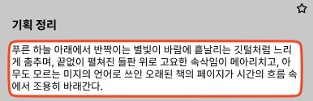
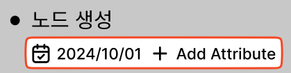
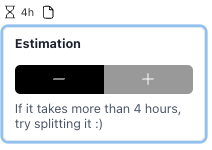

# Node

- Node는 Voyl에서 사용자가 다루는 모든 항목으로, 트리 구조를 형성한다.

## 트리 구조

- Node는 부모와 자식 관계로 계층을 이룬다.
- 시스템의 최상위 노드는 사용자가 직접 생성, 삭제, 수정할 수 없다.
- Node의 Bullet을 클릭하여 화면의 최상위 노드로 설정할 수 있고, 드래그 & 드랍으로 위치를 이동할 수 있다.

## 주요 구성 요소

### 제목

- 한 줄 텍스트로 노드 내용을 표현한다.
- 편집이 가능하다.
- 제목이 비어 있을 때 Backspace로 삭제한다.
- Enter 키를 누르면:
  - 커서 위치를 기준으로 노드가 분리되어 새로운 노드가 생성된다.
    - 예: "abc" 제목에서 "b"와 "c" 사이에 커서가 있을 때, "ab"와 "c"로 나뉜다.
  - 현재 노드가 펼쳐져 있으면 자식 노드로 추가한다.
  - 닫힌 상태면 형제 노드로 추가한다.
- 개행은 지원하지 않는다.

### 내용

- 상세 설명을 위한 장문 입력 공간이다.
- TipTap 라이브러리로 굵게, 기울임, 링크, 개행 등 풍부한 텍스트 편집을 지원한다.

### 속성

- Node의 추가 정보를 설정할 수 있다.
- 마감일(예: 2023-10-20), 완료 여부 등을 설정할 수 있다.
- 날짜, 참/거짓, 숫자, 텍스트를 입력할 수 있다.
- 클릭하면 설정할 수 있는 Popover가 표시된다.

  

- 설정된 속성만 노드의 제목 아래에 표시된다.

## 유형

- 노드는 태스크, 구글 캘린더 스케쥴, 리니어 등 여러 유형을 가질 수 있다.
- 유형은 전용 속성을 가질 수 있다.
  - 태스크는 마감일, 완료 여부 등을 가진다.
  - 구글 캘린더 스케쥴은 날짜를 가진다.
  - 리니어는 포인트, 날짜, 상태 등을 가진다.
