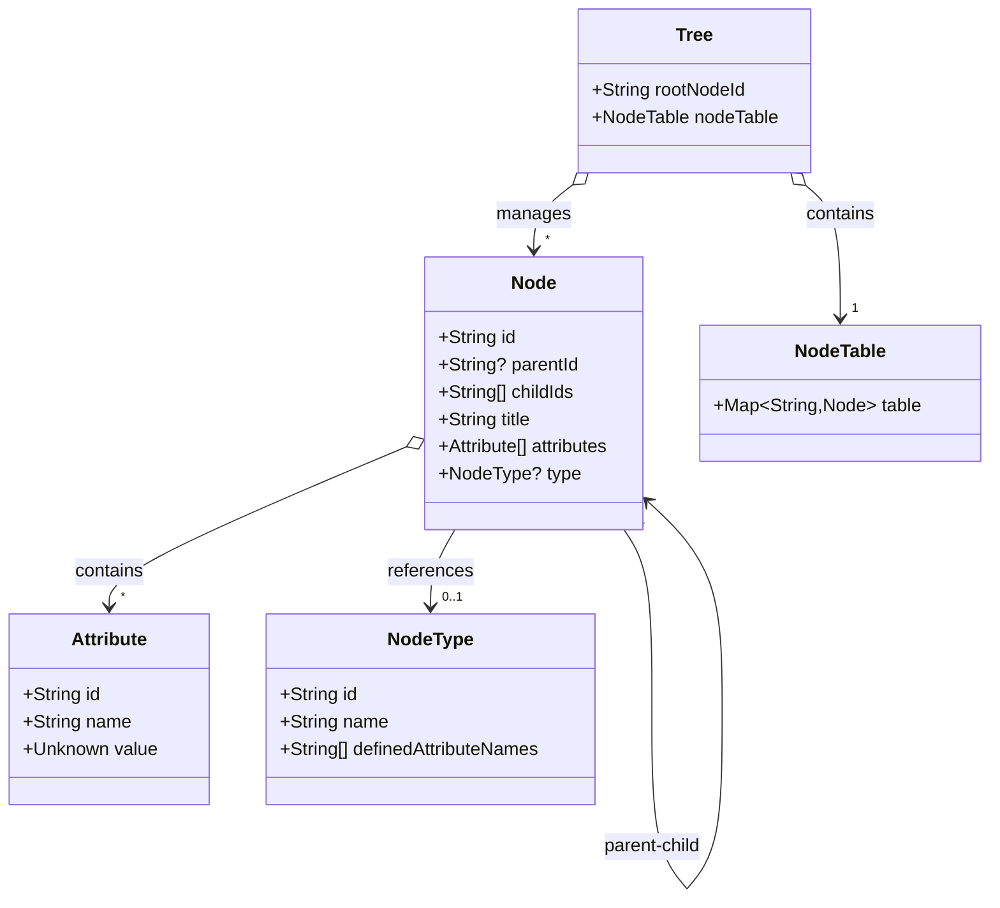

# 시스템 아키텍처 개요

이 시스템은 DDD(Domain-Driven Design)를 기반으로 설계되었으며, 주요 모델 간의 관계는 아래 다이어그램에 나타나 있습니다.

## 다이어그램

_다이어그램: 시스템의 주요 모델과 그 관계를 보여줍니다._

## 모델

- [Node (Aggregate)](models/node.md) - 트리 구조의 기본 단위를 관리합니다.
- [Tree (Aggregate)](models/tree.md) - 전체 트리 구조를 관리합니다.
- [NodeTable (Value Object)](models/nodetable.md) - Node ID와 Node의 관계를 관리합니다.
- [Attribute (Entity)](models/attribute.md) - 노드의 추가 정보를 제공합니다.
- [NodeType (Entity)](models/nodetype.md) - 노드 유형을 정의합니다.
