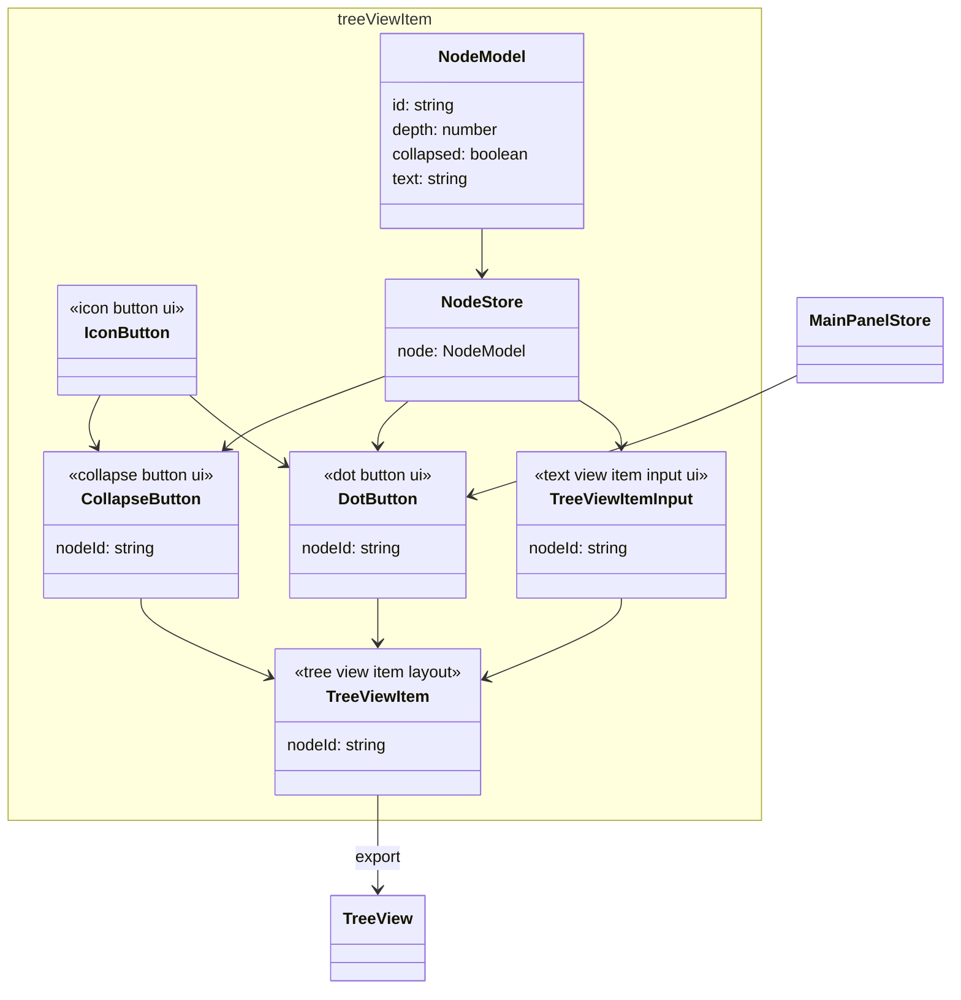

```mermaid
classDiagram
  namespace treeViewItem {
    class TreeViewItem {
    <<tree view item layout>>
      nodeId: string
    }

    class IconButton {
      <<icon button ui>>
    }

    class CollapseButton {
      <<collapse button ui>>
      nodeId: string
    }

    class DotButton {
      <<dot button ui>>
      nodeId: string
    }

    class TreeViewItemInput {
      <<text view item input ui>>
      nodeId: string
    }

    class NodeStore {
      node: NodeModel
    }

    class NodeModel {
      id: string
      depth: number
      collapsed: boolean
      text: string
    }
  }

  TreeViewItem --> TreeView: export
  IconButton --> CollapseButton
  IconButton --> DotButton
  TreeViewItemInput --> TreeViewItem
  MainPanelStore --> DotButton
  NodeModel --> NodeStore
  CollapseButton --> TreeViewItem
  DotButton --> TreeViewItem
  NodeStore --> CollapseButton
  NodeStore --> DotButton
  NodeStore --> TreeViewItemInput
```
