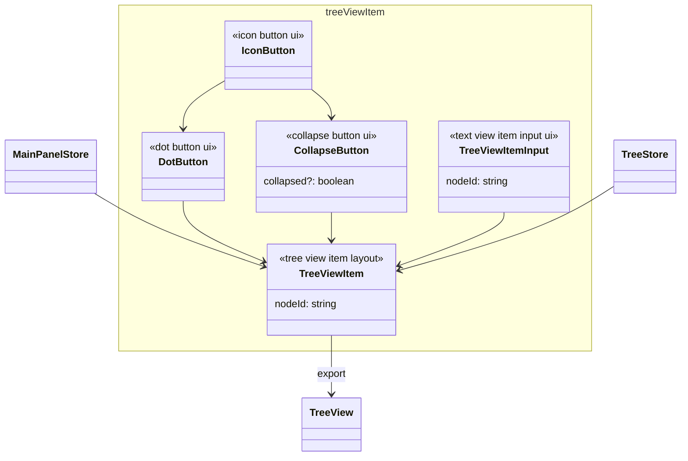

```mermaid
classDiagram
  TreeViewItem --> TreeView: export
  MainPanelStore --> TreeViewItem

  namespace treeViewItem {
    class TreeViewItem {
    <<tree view item layout>>
      nodeId: string
    }

    class IconButton {
      <<icon button ui>>
    }

    class CollapseButton {
      <<collapse button ui>>
      collapsed?: boolean
    }

    class DotButton {
      <<dot button ui>>
    }

    class TreeViewItemInput {
      <<text view item input ui>>
      nodeId: string
    }
  }

  IconButton --> CollapseButton
  IconButton --> DotButton
  DotButton --> TreeViewItem
  CollapseButton --> TreeViewItem
  TreeViewItemInput --> TreeViewItem
  TreeStore --> TreeViewItem
```
