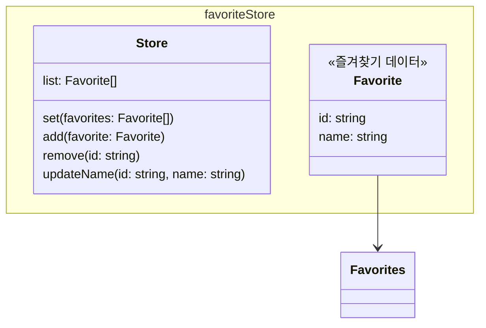

```mermaid
classDiagram
  namespace favoriteStore {
		class Store {
			list: Favorite[]
      set(favorites: Favorite[])
			add(favorite: Favorite)
			remove(id: string)
			updateName(id: string, name: string)
		}

		class Favorite {
			<<즐겨찾기 데이터>>
			id: string
			name: string
		}
	}

	Favorite --> Favorites
```
