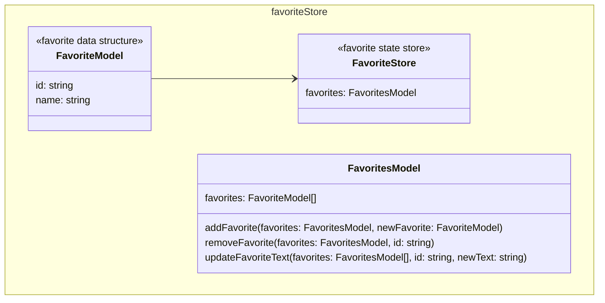

```mermaid
classDiagram
  namespace favoriteStore {
		class FavoriteStore {
      <<favorite state store>>
			favorites: FavoritesModel

		}

		class FavoriteModel {
			<<favorite data structure>>
			id: string
			name: string
		}

    class FavoritesModel {
      favorites: FavoriteModel[]
      addFavorite(favorites: FavoritesModel, newFavorite: FavoriteModel)
			removeFavorite(favorites: FavoritesModel, id: string)
			updateFavoriteText(favorites: FavoritesModel[], id: string, newText: string)
    }
	}

  FavoriteModel --> FavoriteStore
```
